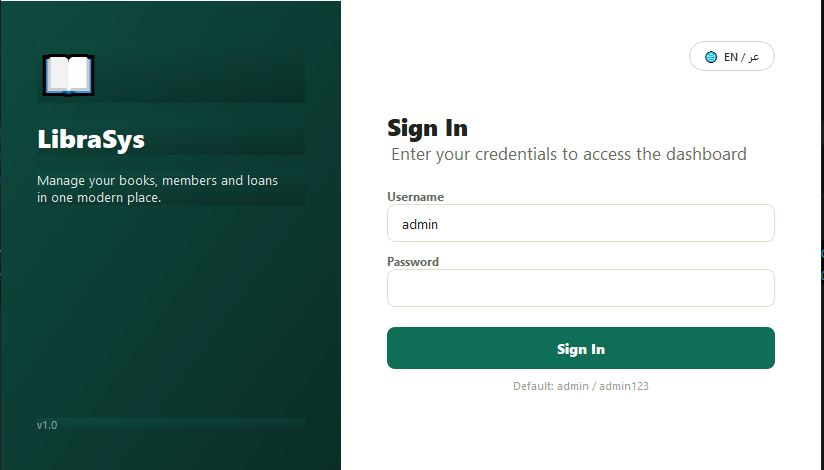
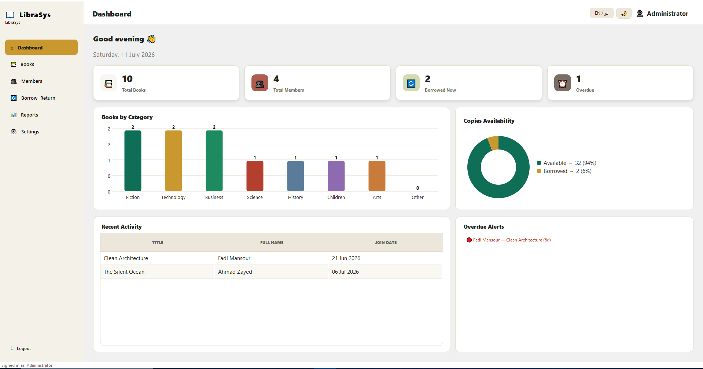
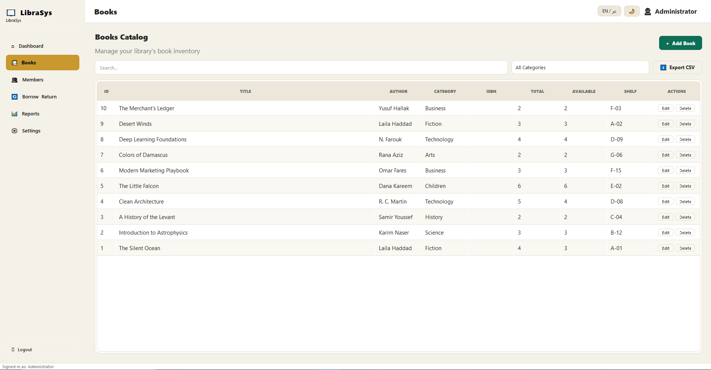
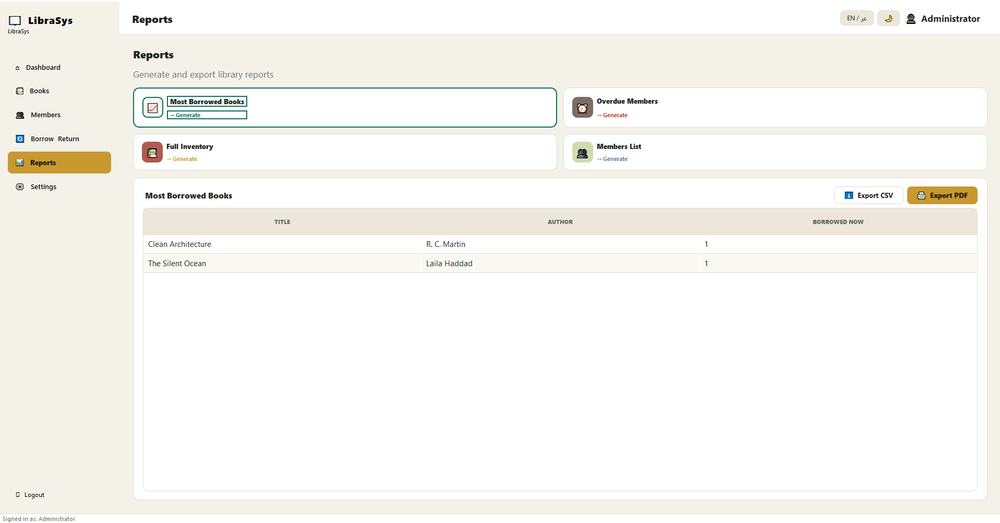

# Libra System

A modern, bilingual (English / Arabic) desktop library management system built with **Python** and **PyQt5**.


---

## 📸 Screenshots

### Login & Authentication
<p align="center">
  
</p>

### Interactive Dashboard
<p align="center">
  
</p>

### Books & Catalog Management
<p align="center">
  
</p>

### System Reports
<p align="center">
  
</p>

---
---

## ✨ Features

- **🌐 Native Bilingual Architecture:** Complete, on-the-fly language switching between English and Arabic without application restarts.
- **🌓 Adaptive Theme Engine:** Centralized dark and light stylesheets that dynamically transition custom UI components and layouts.
- **📊 Interactive Dashboard:** Provides real-time metrics summarizing active books, registered members, critical stock indicators, and rental histories.
- **🔒 Role-Based Authentication:** Clean secure session control to enforce strict administrative access vectors over structural library modifications.
- **📚 Advanced Cataloging & Memberships:** Granular components for checking, updating, archiving, or auditing items and client profiles.
- **🔄 Smart Transaction Handlers:** Automated calculation thresholds handling due dates, overdues, and fine tracking algorithms dynamically.
- **⚙️ Dynamic Parameter Tuning:** Direct runtime configuration adjustments for active global values (e.g. library identification names, customized fine metrics, default borrow limits).

---

##  Project structure


├── core/               
├── dialogs/            
├── pages/              
├── widgets/            
├── librasys.db         
├── main.py             
├── requirements.txt     
└── README.md           
---

##  Getting started

**1. Install dependencies** (Python 3.8+ recommended):

```bash
pip install -r requirements.txt
```

**2. Run the app:**

```bash
python main.py
```

**3. Sign in** with the default admin account:

```
Username: admin
Password: admin123
```

You can change this password from **Settings \u2192 Account & Security** once logged in.

### 

1. : `pip install -r requirements.txt`
2. `python main.py`
3.  `admin` / `admin123` 

---

## \ Customizing the look

All colors live in `core/styles.py` as two plain dictionaries, `LIGHT` and `DARK`. Change any hex value there (primary color, accent, backgrounds, etc.) and every screen updates automatically \u2014 there's no styling duplicated across files.

The library name shown in the sidebar, the currency-less fine amount, and the default loan period are all editable from **Settings** without touching code.

##  Adding more languages

Everything text-facing goes through `lang.tr("some_key")`, backed by the `TRANSLATIONS` dictionary in `core/translations.py`. To add a third language you would extend each entry with a new language code and add a matching option in `LanguageManager`/Settings \u2014 no other file needs to change.

##  Notes & known simplifications

- Deleting a book or a member also removes their borrow history (the confirmation dialogs say so); items currently on loan must be returned first  deletion is blocked in that case.
- The dashboard charts and PDF report tables render left-to-right regardless of the active language, which is standard practice for data visualizations even inside right-to-left interfaces.
- The bundled data is a local SQLite file, so **Backup Database** (Settings \u2192 Data Management) is the recommended way to keep a copy before major changes.

- 

---

Built with \u2764\uFE0F using Python & PyQt5.
